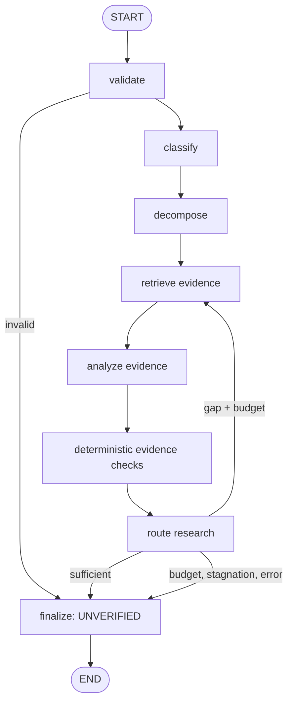

# KajiAI-LangGraph

Standalone Python/LangGraph reimplementation of KajiSF-DJ's active,
evidence-driven claim-analysis workflow. It does not import from or execute the
CrewAI reference project.

The workflow classifies and decomposes a claim, retrieves external evidence,
audits supporting/conflicting/missing evidence, verifies quotation provenance,
and repeats targeted research while bounded by round, search, token, and time
budgets. A model proposes a verdict; verification checks decide whether to accept it.
Anything that fails the gate returns `UNVERIFIED`.

## Architecture



The typed graph state carries the original claim, domain, assertions, complete
retrieval ledger, research rounds, assessment, gaps, contradictions, budgets,
stop reason, verdict, and final report. Each retrieved record retains its URL,
snippet/full-page text, UTC timestamp, SHA-256 content hash, originating query,
provider, and lineage identifier. Similar text across hosts is flagged as
possible copied lineage and cannot satisfy the acceptance gate.

Retrieval failures use policy-controlled bounded retries with linear backoff;
the deadline is checked before every attempt and before sleeping. Retries do
not consume additional logical search calls. Scientific, political, medical,
and general runs inject separate research, analysis, and verification guidance
from configuration into the model prompt.

Acceptance requires all of the following:

- proposed verdict is `TRUE`, `FALSE`, or `MISLEADING` with High confidence;
- every assertion is resolved and cites retrieved evidence;
- every finding has citations and each citation has an exact quote found in its
  retrieved text;
- at least two source hosts are cited without duplicate-lineage warnings;
- counterevidence was searched and the assessment establishes independence;
- no unresolved gaps or contradictions remain;
- domain-specific HTTPS or peer-review requirements pass.

Quotation matching verifies provenance only. It does not prove entailment,
credibility, or truth.
Immediately before accepting a decisive verdict, finalization independently
reruns the structural gate and checks Jev's citation review when enabled. A
changed or stale intermediate state therefore fails closed with
`final_gate_rejected`.

## Install and run

Requirements: Python 3.10–3.13, [`uv`](https://docs.astral.sh/uv/), Ollama, and a TinyFish API key. A TypeSafe key enables Jev review.

```bash
uv sync --extra dev
ollama signin
ollama pull gemma4:31b-cloud
export TINYFISH_API_KEY="your-api-key"
export TYPESAFE_API_KEY="your-typesafe-key"
uv run kaji-langgraph "Claim to investigate" --domain auto --max-rounds 3 --format report
```

Ollama must be running. The defaults match the reference project:

```text
model: gemma4:31b-cloud
endpoint: http://localhost:11434
```

Override them without editing source:

```bash
export KAJI_MODEL=gemma4:31b-cloud
export KAJI_OLLAMA_BASE_URL=http://localhost:11434
export KAJI_TIMEZONE=Asia/Jakarta
```

Live retrieval uses [TinyFish Search](https://docs.tinyfish.ai/search-api/reference)
for ranked URLs and [TinyFish Fetch](https://docs.tinyfish.ai/fetch-api/reference)
for clean page text. Set `TINYFISH_API_KEY` in the environment; the key is never
stored in the project. The graph counts search calls and full-page attempts
against its configured budgets. Fetch failures are recorded in the retrieval
audit and search snippets remain available.

For local `.env` files, use `uv run --env-file .env kaji-langgraph ...`.
The `.env` file is ignored by Git. `uv run` does not load it by default.

If you run this checkout from both Windows and WSL, keep separate virtual
environments. Windows can use the default `.venv`. In WSL, run
`UV_PROJECT_ENVIRONMENT=.venv-wsl uv run --env-file .env kaji-langgraph ...`.
Sharing one `.venv` can leave Unix symlinks that Windows `uv` cannot remove.

When `TYPESAFE_API_KEY` is available, the official TypeSafe Python SDK runs
four Jev judgments in the graph:

- select the claim domain; uncertain selections fall back to Ollama;
- rank search results so the limited full-page fetches target more promising URLs;
- review retrieved sources for relevance, counterevidence, and instructions aimed
  at the assistant; clearly irrelevant or suspicious sources cannot support a verdict;
- compare cited findings with the quote and surrounding source text; unsupported,
  contradictory, or uncertain citations create research gaps. A citation check
  failure returns an auditable `UNVERIFIED` result.

The model and thresholds are in `config/default.yaml`. Jev's judgments and source
scores appear in JSON output under `jev_audit` and `retrieval_ledger`. These are
probabilistic judgments, so evaluate the thresholds against representative claims
before treating accepted verdicts as reliable. `--mock` stays fully offline.

No Anthropic or OpenAI key is used. If Ollama is unavailable, the workflow does
not switch providers: classification/decomposition may use deterministic
fallbacks, but analysis fails closed to an auditable `UNVERIFIED` report.

For a fully offline deterministic smoke run:

```bash
uv run kaji-langgraph "The deterministic fixture claim is documented" --mock --format report
```

Run tests:

```bash
uv run pytest
```

## Output and limitations

`--format` accepts `report`, `brief`, or `json`. JSON includes the full retrieval
ledger, source lineage, queries, timing, budgets, research history, and errors.
The system is a research assistant, not a truth oracle. Search snippets may be
incomplete; source independence and semantic entailment still require human
review even when deterministic structural checks pass.
